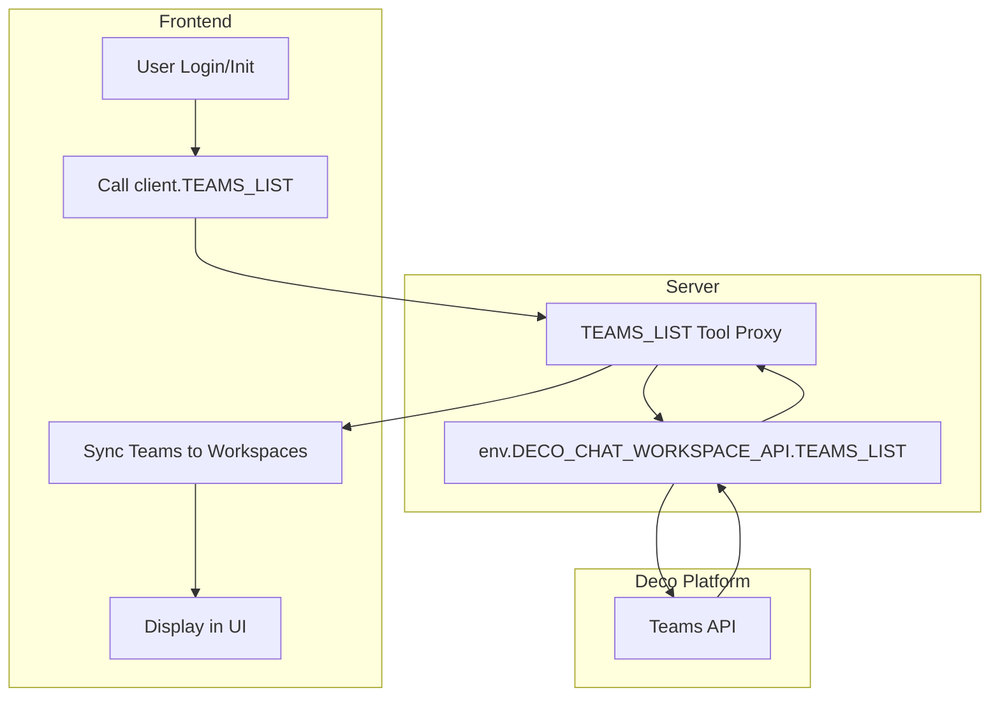

# Teams & Workspace Implementation

## Overview
Implemented the foundation for **Teams & Workspaces** functionality, integrating with Deco's TEAMS_LIST API to automatically create workspaces from user teams while supporting local workspaces.

## Key Changes

### 1. Server-Side Tool Proxy
**File:** `server/main.ts`
- Created `createTeamsListTool` to proxy the Deco platform's TEAMS_LIST API
- Registered the tool in the runtime for RPC access
- Handles response parsing (string to JSON if needed)

### 2. Data Models
**File:** `view/src/types/project.ts`
- `Team`: Structure from Deco API (id, name, slug, theme, avatar_url)
- `Workspace`: Can be linked to a Team (teamId) or local (isLocal flag)
- `Project`: Contains schema data, nodes, edges, explorer settings
- `SessionState`: Tracks current workspace/project for quick restoration

### 3. Repository Pattern
**Files:** 
- `view/src/repositories/IProjectRepository.ts` - Interface definition
- `view/src/repositories/LocalProjectRepository.ts` - LocalStorage implementation

Features:
- Teams fetching via RPC (`client.TEAMS_LIST()`)
- Automatic sync of teams to workspaces
- Full CRUD operations for workspaces and projects
- Migration from v1 (single project) to v2 (workspaces)
- Session state persistence

### 4. State Management
**File:** `view/src/store/workspaceStore.ts`
- Zustand store with persist middleware
- Manages current workspace/project selection
- Caches projects per workspace
- Background team fetching and syncing
- Auto-save of project data with debouncing

### 5. UI Components
**Files:**
- `view/src/components/WorkspaceSwitcher.tsx` - Dropdown for workspace selection
- `view/src/components/ProjectSwitcher.tsx` - Dropdown for project management
- `view/src/components/ui/dropdown-menu.tsx` - Radix UI dropdown component
- `view/src/components/ui/dialog.tsx` - Radix UI dialog component

Features:
- Visual distinction between team workspaces (with avatars) and local workspaces
- Create, rename, duplicate, delete operations
- Keyboard shortcuts support (ready for implementation)
- Current selection indicators

## RPC Usage Pattern

Following the established pattern from ai-usage docs:

```typescript
// ✅ CORRECT: Direct tool call
const teams = await client.TEAMS_LIST({});

// ❌ WRONG: Using .tools namespace
const teams = await client.tools.TEAMS_LIST({});
```

## Data Flow



## Migration Strategy

1. **First Run Detection**: Checks for `schemaos.v1` in localStorage
2. **Auto Migration**: Creates default workspace and converts existing data
3. **Session Restoration**: Maintains last opened workspace/project
4. **Team Sync**: Fetches teams in background and creates workspaces

## Next Steps

### Integration with Main App
1. Add WorkspaceSwitcher and ProjectSwitcher to main App.tsx layout
2. Update existing stores to read from `currentProject.data`
3. Implement auto-save hooks for canvas/explorer changes
4. Add export/import functionality for projects

### Future Enhancements
1. Workspace themes from team configuration
2. Collaborative features (when backend is ready)
3. Project templates
4. Workspace-level settings and permissions
5. Real-time sync with Deco platform

## Testing Checklist

- [ ] Teams fetch from Deco API
- [ ] Workspace creation (team-linked and local)
- [ ] Project CRUD operations
- [ ] Data migration from v1
- [ ] Session state persistence
- [ ] UI responsiveness and error handling

## Dependencies Added

- `@radix-ui/react-dropdown-menu` - For dropdown menus
- Already had `@radix-ui/react-dialog` - For modal dialogs

## Architecture Benefits

1. **Offline-First**: Full functionality without internet
2. **Repository Pattern**: Easy to swap storage backends
3. **Type Safety**: Full TypeScript coverage
4. **Performance**: Lazy loading and caching of projects
5. **User Experience**: Seamless workspace/project switching