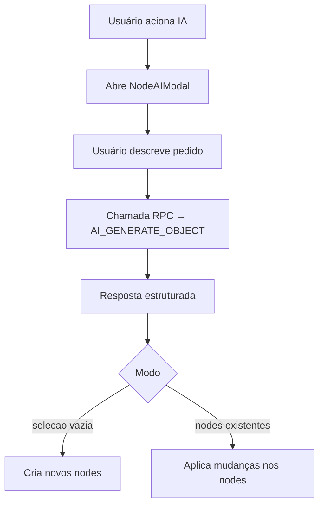

# Plano: Unificar Fluxos de IA – Criação de Schema & Edição de Nodes

> Data: 2025-08-05  
> Responsável: Time SchemaOS

---

## 🎯 Objetivo
Unificar os dois pontos de entrada atuais de IA em um **único modal**:

1. **Criar novo Schema via IA** (botão *AI Schema* na sidebar)
2. **Editar/gerar SQL a partir de seleção de nodes** (menu flutuante no canvas)

Dessa forma, toda interação com IA seguirá o mesmo fluxo de UX, reutilizando componentes, store e lógica de backend.

---

## 🔄 Fluxo Unificado

### Pontos-chave
- **selectedNodeIds**: pode estar vazio → criação; não-vazio → edição.
- **nodeAIMode**: `'edit' | 'sql' | 'create'` (novo modo *create*).
- Mesmo **NodeAIModal** lida com ambos os casos.

---

## 🗂️ Tarefas Principais

1. **Store**
   - Adicionar `nodeAIMode = 'create' | 'edit' | 'sql'`.
   - Quando chamado pelo botão *AI Schema*, `selectedNodeIds = ∅` e `nodeAIMode = 'create'`.

2. **UI**
   - Reaproveitar botão existente (*AI Schema*) para abrir o modal.
   - Mostrar mensagem "No nodes selected – a new schema will be created" quando `selectedNodeIds.size === 0`.

3. **Modal**
   - Adaptar placeholders:  
     • *create*: "Describe the schema you want to generate…"  
     • *edit*: "Describe the changes…"  
     • *sql*: "Describe the SQL you want…"
   - Ao aplicar resultado em *create*, inserir novos nodes no canvas.

4. **Backend Tool**
   - Reutilizar `NODE_AI_ASSISTANT`; incluir modo `'create'` com schema apropriado (`nodes` obrigatórios).

5. **Integrity Checks**
   - Mesmas validações já criadas para edição.

6. **Docs & Tests**
   - Atualizar README e planos.
   - Unit tests para criação de nodes via IA.

---

## ❓ Perguntas em Aberto
1. **Tipos Extras?**  
   Campos como *foreign keys* ou *unique constraints* devem ser suportados no modo criação?
2. **Templates de Esqueleto?**  
   Devemos oferecer exemplos predefinidos (ex: "Blog", "E-commerce") no modal?
3. **Undo/Redo**  
   Precisamos de um recurso de desfazer para mudanças aplicadas pela IA?
4. **Versionamento**  
   Devemos guardar histórico das interações de IA para auditoria?

---

## 📅 Linha do Tempo Sugerida
| Dia | Atividade |
|-----|-----------|
| 1   | Ajustes no store + abrir modal pelo botão AI Schema |
| 2   | Implementar modo *create* no backend e no modal |
| 2   | Validações + inserção de novos nodes |
| 3   | Testes unitários/E2E + documentação |
