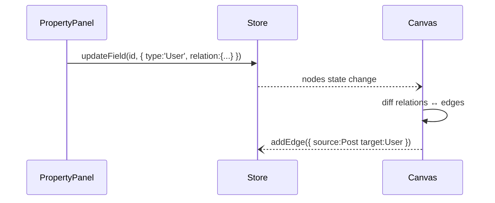

# 📐 Plano — Refactor de Tipos & Relações 2.0

> Data: 2025-08-05  
> Responsável: Time SchemaOS  
> Status: 📋 **Em Planejamento**

---

## 1. Por que mudar?

1. As relações hoje apontam para **campo alvo** (`Entity.field`) → isso gera setas múltiplas e confusas.  
2. Precisamos de **garantia visual**: toda relação deve criar/atualizar automaticamente um *edge* React-Flow.  
3. O modelo deve ser **familiar à sintaxe TypeScript** para facilitar geração pela IA (ex.: `author: User | null`).  
4. Manter a separação entre **tipo lógico** (campo aponta para uma entidade) e **estratégia de storage** (FK, embedded, join-table).

---

## 2. Objetivos

| # | Objetivo | Métrica de Sucesso |
|---|-----------|--------------------|
| 1 | Redefinir `Field.type` para aceitar `EntityName` ou primitivos | Tipagem Zod atualizada + testes passam |
| 2 | `relation.target` passa a receber **apenas o Node/Entity** | UI dropdown mostra só entidades, não campos |
| 3 | Ao adicionar/remover relação → atualizar `edges` automaticamente | Edge aparece/desaparece sem recarregar página |
| 4 | Bloquear criação manual de edges | Drag manual entre nodes desativado |
| 5 | Gerador SQL continua funcional | E2E: gerar schema + SQL sem erros |

---

## 3. Modelo de Tipos Proposto

### 3.1 Enum de Primitivos _(mantém)_
`string | number | boolean | date | datetime | uuid | json | array | object | email | url`

### 3.2 **Novos** Campos para Relação
```ts
interface RelationMeta {
  targetEntity: string;   // "User", "Order" (Node name)
  storage: 'foreign-key' | 'embedded' | 'join-table';
  description?: string;
}
```

### 3.3 Definição de Field
```ts
interface Field {
  id: string;
  name: string;                    // "author"
  /**
   * Pode ser primitivo **ou** o nome de outra entidade (caso relation!=undefined)
   */
  type: PrimitiveType | string;    // "User" referencia Node "User"
  required: boolean;
  isPrimary: boolean;
  relation?: RelationMeta;         // Presente se type === targetEntity
  // UI helpers
  description?: string;
  expanded?: boolean;
}
```

Regras:
1. `relation` **obrigatório** se `type` NÃO for primitivo.
2. `relation.targetEntity` **deve coincidir** com `type` (garantia de coerência).

---

## 4. Mudanças no Frontend

### 4.1 Store (`view/src/store.ts`)
- Refatorar `Field` conforme acima.  
- `addEdge`/`deleteEdge` passam a ser **privadas**—fluxo controlado pelo relation handler.

### 4.2 PropertyPanel
- Dropdown `Field.type` agora mostra **primitivos + lista de entities**.  
- Se usuário escolher entity ⇒ exibir seletor de `storage` (FK/embedded/join-table).  
- Remover campo de seleção de `target.field`.

### 4.3 Canvas / React-Flow
- Desativar drag-connect.  
- Listener `onNodesChange`/`onFieldsChange`:
  - Se `field.relation` adicionado ⇒ `addEdge()` entre entidades.
  - Se removido ⇒ remover edge.
- Edge label = `FK | Embedded | Join`.

---

## 5. Backend / Validações

### 5.1 `schema-types.ts`
- Adicionar util `isPrimitive(type)`.
- Validação: se `relation` existe mas `type` é primitivo → erro & vice-versa.

### 5.2 AI Schemas (`NodeAIModal`)
- `Field.type` enum = `[...PrimitiveTypes, EntityNames...]`  
  (criar dinamicamente a cada chamada).
- `relationMeta` atualizado.

---

## 6. Gerador SQL (`sql-builder.ts`)

- FK: continuar igual (`entityId UUID REFERENCES Entity(id)`).  
- Embedded: nenhuma FK, comentário.  
- Join-table: auto-gerar tabela se não existir (já implementado).

---

## 7. Fluxo de Atualização de Edge



Algoritmo **diff relations ↔ edges**:
1. Para cada node, para cada field.relation ⇒ cria chave `source-target`.  
2. Construir `expectedEdgeSet`.  
3. Comparar com `currentEdgeSet` (state).  
4. `addEdge` para faltantes; `deleteEdge` para órfãos.

---

## 8. Testes

1. **Unit**: `validateField()` cobre novas regras.  
2. **Integration**: criar field→ relation → edge aparece.  
3. **E2E Cypress**: usuário cria Post.author → seta FK para User → edge renderiza.

---

## 9. Cronograma

| Dia | Entrega |
|-----|---------|
| 1   | Refatorar tipos & validação Zod |
| 2   | PropertyPanel UI + novidades store |
| 3   | Edge diff logic + bloqueio drag |
| 4   | AI schemas & prompt update |
| 5   | Testes unit + E2E |

---

## 10. Riscos / Mitigações

| Risco | Impacto | Mitigação |
|-------|---------|-----------|
| AI gera nome de entidade inexistente | Edge inválido | Validação + fallback warning |
| Ciclo de dependência FK | Migration falha | Ordenação topológica + defer constraints |
| Usuário remove node com edges | Orfãos | `onDeleteNode` → remove relations |

---

> **Próximos Passos:** Revisar plano, aprovar e iniciar sprint de implementação 🚀
