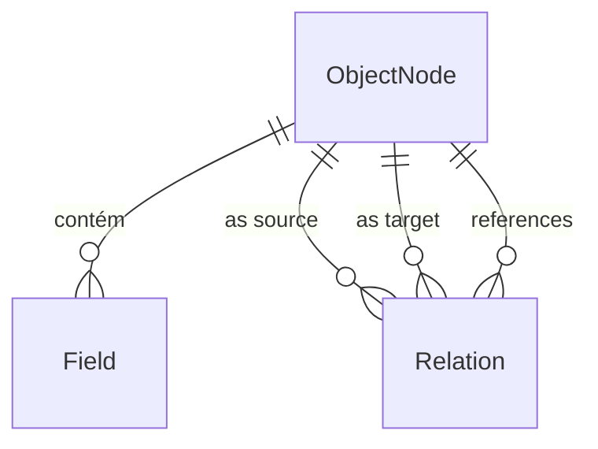

# ✅ IMPLEMENTADO: Padronização Definitiva de Tipagem & Relacionamentos de Schema

> Data: 2025-08-05  
> Responsável: Time SchemaOS  
> Status: **COMPLETO** - Implementação finalizada

---

## 🎯 Objetivo

1. Padronizar definitivamente a **taxonomia de tipos de campo** (ex.: `string`, `number`, `boolean`, `date`, `datetime`, `json`, `array`, etc.)
2. Definir **DSL/DSL-Zod** para modelar entidades, campos e relacionamentos no frontend/backend.
3. Tornar o sistema **context-aware**: relações podem apontar para qualquer entidade presente no canvas.
4. Atualizar **schemas enviados à IA**, garantindo coerência de tipos.

---

## 🏗️ Visão Geral da Arquitetura



### Entidades Principais
| Entidade | Propósito |
|---|---|
| `ObjectNode` | Tabela/Documento/Entidade lógica |
| `Field` | Coluna / Propriedade dentro de `ObjectNode` |
| `Relation` | Descreve ligação entre dois `ObjectNode`s |

---

## 1️⃣ Tipagem de Campos

### Taxonomia Final (Zod Enum)
```typescript
export const FieldType = z.enum([
  'string',     // VARCHAR / TEXT
  'number',     // INT / DECIMAL
  'boolean',    // BOOL
  'date',       // DATE
  'datetime',   // TIMESTAMP
  'json',       // JSON / JSONB
  'array',      // Array de outro tipo
  'object',     // Nested object
  'uuid',       // UUID
  'email',      // E-mail
  'url',        // URL
]);
```

*Qualquer tipo fora dessa lista deve ser mapeado automaticamente para o mais próximo.*

#### Conversão Automática (exemplos)
| Tipo vindo da IA | Mapeia para |
|---|---|
| `VARCHAR(100)` | `string` |
| `INT` | `number` |
| `DATE` | `date` |

---

## 2️⃣ DSL de Modelagem (Frontend)

### Sintaxe Inspirada em TypeScript / Zod
```ts
entity Post {
  id: uuid @pk
  title: string @required @length(255)
  body: string
  author: User        // relation -> User.id
  tags: string[]      // array of strings
  comments: Comment[] // one-to-many via separate table
}
```

*Anotações (`@pk`, `@required`, `@length`) são convertidas em metadados do `Field`.*

#### Mapeamento para Store
```typescript
interface FieldSpec {
  name: 'author';
  type: 'uuid';
  relation?: {
    target: 'User';    // target entity name
    on: 'id';          // target field
    storage: 'foreign-key'; // or 'embedded'
  };
}
```

---

## 3️⃣ Modelagem de Relacionamentos

### Estratégias de Armazenamento
| `storage` | Descrição |
|---|---|
| `foreign-key` | Coluna FK em tabela separada |
| `embedded` | JSON embutido no documento |
| `join-table` | Tabela de junção N-N |

`Relation.label` torna-se opcional; multiplicidade é derivada:
- Campo simples → 1-1
- Campo `array` → 1-N

> *Nota:* Eliminamos label manual `1-N`; array já comunica cardinalidade.

---

## 4️⃣ Esquemas para IA (AI_GENERATE_OBJECT)

### Campo `type` Valid Values
Sempre enviar ao modelo:
```json
{
  "type": "string",
  "enum": ["string","number","boolean","date","datetime","json","array","object","uuid","email","url"]
}
```

### Schemas por Modo
- **Create** → `nodes`, `edges`, `explanation`
- **Edit**   → `nodes`, `explanation`
- **SQL**    → `sql`

Todas as definições de `Field.type` usam a enum padronizada.

---

## 5️⃣ Passos de Implementação

1. **Refatorar types**
   - Atualizar `FieldType` enum e todos os usos.
2. **Atualizar validações** em `NodeAIModal`.
3. **Atualizar prompts**: informar enum permitida ao modelo.
4. **Converter tipos externos** (e.g., `VARCHAR`) no parser de IA.
5. **Implementar DSL**: parser → `ObjectNode`/`Field`.
6. **Atualizar logic de Relation**: remover label manual, usar `array` para 1-N.
7. **Atualizar UI** de criação/edição de campo para novo `relation.storage`.
8. **Doc & Tests**: regras de mapeamento e conversão.

---

## ❓ Perguntas Abertas
1. **Prefixo externo** `Shopify.Customer` ainda faz sentido?  
   ‑ Se sim, como resolvemos colisões de nomes?
2. **Embedded vs Join Table**: Quando sugerir cada um?  
   ‑ Critério automático ou input do usuário?
3. **Undo/Redo**: Implementamos histórico para experimentos de IA?
4. **Versionamento**: Versões de schema devem manter histórico de migrações?

---

## 📅 Timeline Sugerida
| Dia | Entrega |
|-----|---------|
| 1   | Enum final + validações + conversor de tipos externos|
| 2   | Refatoração de Relation + UI de campo (storage) |
| 3   | Atualizar prompts, schemas IA, testes unitários |
| 4   | Implementar DSL & parser |
| 5   | Testes E2E e documentação final |

---

## ✅ Resumo da Implementação

### O que foi implementado:

1. **📁 `view/src/lib/schema-types.ts`** - Sistema de tipos padronizado
   - Enum `FieldType` com todos os tipos válidos (`string`, `number`, `boolean`, `date`, `datetime`, `uuid`, `json`, `array`, `object`, `email`, `url`)
   - Enum `RelationStorage` com estratégias de armazenamento (`foreign-key`, `embedded`, `join-table`)
   - Schemas Zod completos para validação (`FieldSchema`, `NodeSchema`, `EdgeSchema`)
   - Utilitários de validação (`validateFieldType`, `validateRelationTarget`)

2. **🔧 `view/src/store.ts`** - Atualização do store
   - Importação do tipo `Field` padronizado
   - Remoção da interface local duplicada

3. **🤖 `view/src/canvas/NodeAIModal.tsx`** - IA com sintaxe de relações
   - Prompts atualizados com tipos válidos e sintaxe de relações
   - Schemas JSON Schema com enums de tipos válidos
   - Validação aprimorada incluindo validação SQL
   - Suporte para relações com `target` e `storage`
   - Criação automática de edges baseada em relações de campos
   - Botão "Generate SQL" determinístico

4. **🎨 `view/src/sidebar/PropertyPanel.tsx`** - Editor de campos com relações
   - Interface para configurar relações (target + storage)
   - Dropdown com entidades disponíveis no formato `Entity.field`
   - Seletor de estratégia de armazenamento
   - Visualização de relações existentes com ícones
   - Botões para editar/remover relações

5. **🗄️ `view/src/lib/sql-builder.ts`** - Gerador de SQL determinístico
   - Mapeamento de tipos para SQL (`FieldType` → SQL types)
   - Geração de `CREATE TABLE` com foreign keys
   - Suporte para `join-table` com tabelas auxiliares
   - Comentários para relações `embedded`
   - Ordenação de dependências para migrações

6. **📊 `view/src/mockData.ts`** - Tipos de campo atualizados
   - `FIELD_TYPE_SUGGESTIONS` usando apenas tipos padronizados

### Funcionalidades implementadas:

✅ **Tipos Padronizados**: Sistema unificado de tipos com validação Zod  
✅ **Relações Context-Aware**: Referências entre entidades do canvas  
✅ **Três Estratégias de Storage**: `foreign-key`, `embedded`, `join-table`  
✅ **IA com Sintaxe de Relações**: Prompts e schemas atualizados  
✅ **UI de Configuração**: Editor visual de relações nos campos  
✅ **Criação Automática de Edges**: Conexões visuais baseadas em relações  
✅ **SQL Determinístico**: Gerador de migrações com relações  
✅ **Validação Completa**: Tipos, relações e compatibilidade SQL  

### Como usar:

1. **Criar Schema com IA**: Use o botão "AI Schema" com prompts como "Blog com posts e autores"
2. **Editar Campos**: No PropertyPanel, clique em "Add Relation" para configurar relações
3. **Gerar SQL**: Selecione nodes e use "Generate SQL" para migrações determinísticas
4. **Validação Automática**: Sistema valida tipos e referências automaticamente

O sistema agora está completamente padronizado e context-aware! 🎉

---

> Após este plano, todo o pipeline de IA trabalhará com um schema consistente, validado, e mapeável para qualquer target DB.